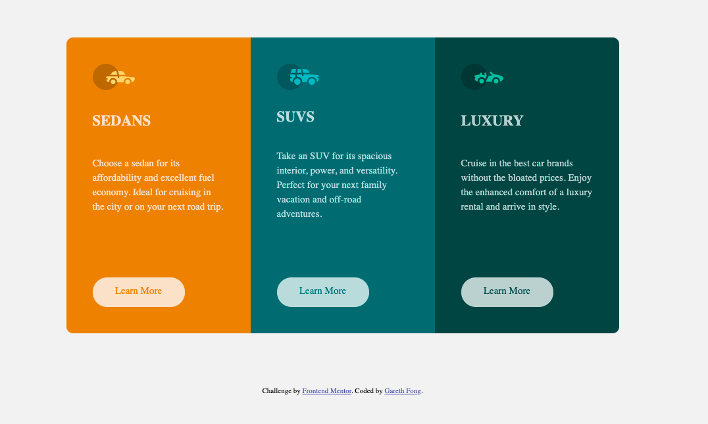
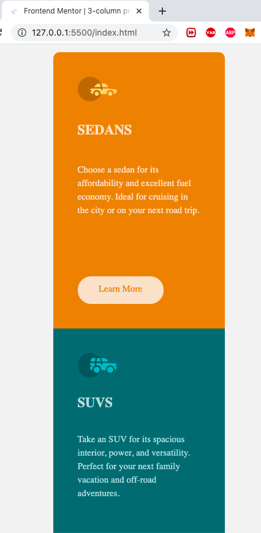

# Frontend Mentor - 3-column preview card component solution

This is a solution to the [3-column preview card component challenge on Frontend Mentor](https://www.frontendmentor.io/challenges/3column-preview-card-component-pH92eAR2-). Frontend Mentor challenges help you improve your coding skills by building realistic projects. 

## Overview

### The challenge

Users should be able to:

- View the optimal layout depending on their device's screen size
- See hover states for interactive elements

### Screenshot

Desktop Screenshot

Mobile Screenshot (Partial)

### Links

- Solution URL: (https://github.com/ImGareth83/preview-card-component-main.git)
- Live Site URL: (https://imgareth83.github.io/preview-card-component-main/)

### Built with

- Semantic HTML5 markup
- Sass
- CSS custom properties
- Flexbox
- CSS Grid
- Mobile-first workflow